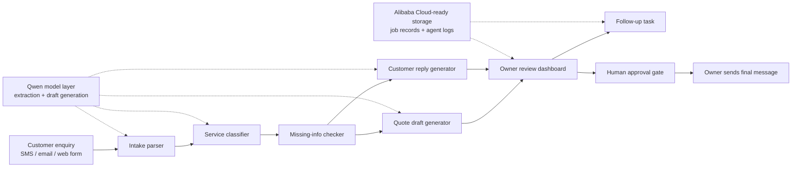

# AF-003｜Architecture Diagram

This diagram explains the demo architecture for **Handyman Quote-to-Follow-up Autopilot**.



## Explanation

The project is intentionally scoped to one workflow:

```text
messy customer enquiry -> structured business action
```

The agent helps with:

- extracting job details,
- identifying missing information,
- drafting a non-binding quote,
- drafting a customer reply,
- creating a follow-up task.

The owner remains in control. Nothing is sent to the customer automatically.

## Qwen integration point

Qwen can be used for:

- extracting structured fields from messy customer messages,
- classifying service type,
- generating quote draft text,
- generating customer reply drafts.

## Alibaba Cloud integration point

Alibaba Cloud can be used for:

- storing job records,
- storing agent logs,
- hosting the demo service,
- recording follow-up tasks.

## Safety boundary

The final architecture keeps a human approval gate before any message or quote reaches a real customer.

